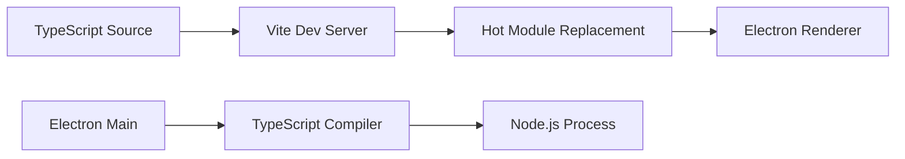
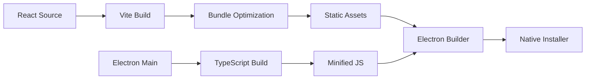

# 🔧 Build Configuration Documentation

> *Comprehensive guide to the build system, TypeScript configuration, and development workflow for Weenus AI*

## 📋 Overview

Weenus AI uses a modern build system combining Vite for the renderer process and TypeScript compilation for the Electron main process. This setup provides fast development iteration, optimized production builds, and excellent TypeScript support throughout.

## 🏗️ Build Architecture

### Dual Process Architecture
```
Weenus AI Application
├── Main Process (Electron)    # Node.js environment
│   ├── Window management
│   ├── Native API access
│   ├── File system operations
│   └── IPC communication
└── Renderer Process (Vite)    # Browser environment
    ├── React UI components
    ├── State management
    ├── API clients
    └── User interactions
```

## ⚙️ Configuration Files

### `tsconfig.json` - Main TypeScript Configuration
**Purpose**: Controls TypeScript compilation for the renderer process (React components)

**Key Features**:
- **Target**: ES2020 for modern JavaScript features
- **Module System**: ESNext with bundler resolution for Vite compatibility
- **Path Mapping**: Clean imports with `@/` aliases
- **Strict Mode**: Maximum type safety with all strict checks enabled
- **JSX**: React JSX transform for modern React

```typescript
// Example of clean imports enabled by path mapping
import { ChatMessage } from '@/components/ChatMessage'
import { ollamaService } from '@/services/OllamaService'
import { chatSlice } from '@/store/chatSlice'
```

### `electron.tsconfig.json` - Electron Main Process Configuration
**Purpose**: Separate TypeScript configuration for Electron main and preload scripts

**Key Differences**:
- **Target**: ES2020 with CommonJS modules for Node.js compatibility
- **Output**: Compiled to `build/electron/` directory
- **Include**: Only Electron-specific files (`electron/` directory)
- **Source Maps**: Full debugging support with declaration files

### `tsconfig.node.json` - Build Tools Configuration
**Purpose**: TypeScript configuration for build tools (Vite config, etc.)

**Features**:
- Composite project for faster builds
- ESNext modules for modern build tools
- Minimal configuration for build-time scripts

## 🚀 Vite Configuration

### Development Features
- **Hot Module Replacement**: Instant updates during development
- **Path Resolution**: Automatic `@/` alias resolution
- **CORS Support**: Enabled for Electron integration
- **Source Maps**: Full debugging support

### Production Optimizations
- **Bundle Splitting**: Optimized chunks for faster loading
  - `vendor`: React core libraries
  - `redux`: State management libraries
  - `router`: Navigation libraries
  - `ui`: Animation and icon libraries
- **Tree Shaking**: Eliminates unused code
- **Asset Optimization**: Compressed images and optimized fonts
- **Modern Targets**: ES2020+ for smaller bundles

### Electron Integration
- **Base Path**: Relative paths for Electron file:// protocol
- **No Browser Opening**: Prevents browser launch during development
- **Environment Variables**: Secure environment variable handling
- **Icon Support**: Cross-platform icon configuration (`.ico`, `.icns`, `.png`)

## 🎨 Styling Configuration

### Tailwind CSS Setup
**Purpose**: Utility-first CSS framework with custom design system

**Features**:
- **Custom Color Palette**: Weenus AI brand colors with dark mode variants
- **Typography Scale**: Inter font for UI, JetBrains Mono for code
- **Animation System**: Custom animations for smooth interactions
- **Glass Morphism**: Modern backdrop blur and transparency effects
- **Dark Mode**: Class-based dark mode with system preference detection

### PostCSS Processing
- **Tailwind CSS**: Utility class processing
- **Autoprefixer**: Automatic vendor prefix addition
- **CSS Optimization**: Minification and dead code elimination

## 🔄 Development Workflow

### Available Scripts

#### Development
```bash
npm run dev          # Start both Vite and Electron in development mode
npm run dev:vite     # Start only Vite development server
npm run dev:electron # Start only Electron (requires Vite running)
```

#### Building
```bash
npm run build        # Build both renderer and main process
npm run build:vite   # Build only renderer process
npm run build:electron # Build only main process
```

#### Quality Assurance
```bash
npm run test         # Run all tests
npm run test:watch   # Run tests in watch mode
npm run test:coverage # Generate coverage report
npm run lint         # Check code style and errors
npm run lint:fix     # Fix auto-fixable issues
npm run format       # Format code with Prettier
```

### Development Server Startup
1. **Vite Development Server**: Starts on `http://localhost:5173`
2. **Wait for Ready**: `wait-on` ensures Vite is ready
3. **Electron Launch**: Loads the Vite development URL
4. **Hot Reload**: Changes reflect instantly in Electron window

## 📦 Build Process

### Development Build


### Production Build


## 🛠️ TypeScript Features

### Path Mapping Benefits
- **Cleaner Imports**: No more `../../../components`
- **Refactoring Safety**: IDE can track and update imports
- **Team Consistency**: Standardized import patterns

### Type Safety Features
- **Strict Null Checks**: Prevents null/undefined errors
- **No Implicit Any**: Requires explicit types
- **Unused Variable Detection**: Catches dead code
- **Switch Statement Completeness**: Ensures all cases handled

### Development Experience
- **IntelliSense**: Full autocomplete and documentation
- **Error Checking**: Real-time error detection
- **Refactoring Tools**: Safe renaming and restructuring
- **Import Organization**: Automatic import sorting and cleanup

## 🔧 Customization Options

### Adding New Path Aliases
1. Update `tsconfig.json` paths mapping
2. Update `vite.config.ts` resolve.alias
3. Restart development server

### Modifying Build Targets
- **Browser Support**: Update `browserslist` in package.json
- **Node.js Version**: Adjust target in electron.tsconfig.json
- **Bundle Size**: Modify chunk splitting in vite.config.ts

### Environment Configuration
- **API URLs**: Set in environment variables
- **Feature Flags**: Configure in build-time constants
- **Debug Options**: Control via NODE_ENV and custom flags

## 🐛 Troubleshooting

### Common Issues

#### TypeScript Errors
- **Module Not Found**: Check path aliases in tsconfig.json
- **Type Errors**: Ensure all dependencies have type definitions
- **Build Failures**: Verify electron.tsconfig.json output directory

#### Build Problems
- **Vite Errors**: Check for syntax errors in imported files
- **Electron Issues**: Verify main entry point in package.json
- **Missing Dependencies**: Run `npm install` after adding packages

#### Development Server
- **Port Conflicts**: Change port in vite.config.ts
- **CORS Issues**: Verify cors setting in development server
- **Hot Reload Failed**: Restart development server

### Performance Optimization
- **Build Speed**: Use TypeScript project references
- **Bundle Size**: Analyze with `npm run build` and check output
- **Memory Usage**: Monitor during development with large projects

---

*This build documentation is updated when configuration changes are made. Last updated: November 2025*

## 📅 Recent Updates (November 11, 2025)

### ✅ Build System Status
- **Vite Production Build**: ✅ Successfully compiling (0 errors, 1383 modules)
- **Electron TypeScript**: ✅ Compiling without errors
- **Icon Configuration**: ✅ Properly referenced in `electron/main.ts` with path `../../src/assets/icons/icon.png`
- **Bundle Optimization**: ✅ CSS minified (49KB gzip), JS split across vendor/ui/router/redux chunks

### 🔄 Parameter Integration Build
The critical parameter wiring fix (integrating `useModelParameters` into ChatPage API calls) compiled successfully:
- Added `useModelParameters` import and hook usage
- Updated `/api/chat` fetch to include `options` with all 5 parameters
- Field name mapping verified:
  - `temperature` → `temperature`
  - `topP` → `top_p`
  - `topK` → `top_k`
  - `repeatPenalty` → `repeat_penalty`
  - `maxTokens` → `num_predict`

### 📊 Build Output Summary
```
✓ 1383 modules transformed
build/renderer/index.html              1.46 kB │ gzip:  0.71 kB
build/renderer/assets/index-*.css     49.11 kB │ gzip:  8.19 kB (styling)
build/renderer/assets/index-*.js      55.03 kB │ gzip: 14.61 kB (main app)
build/renderer/assets/vendor-*.js    140.92 kB │ gzip: 45.30 kB (dependencies)
✓ built in 4.12s
```